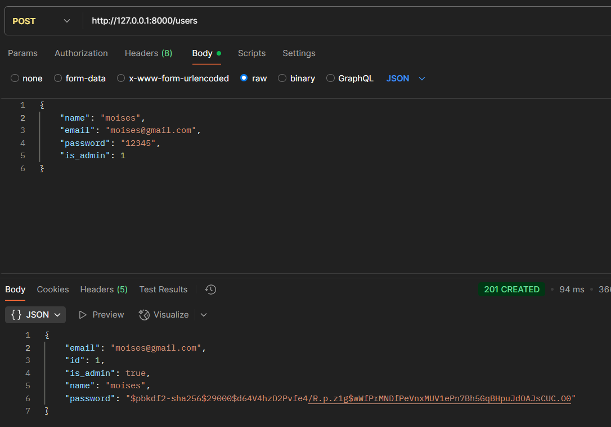
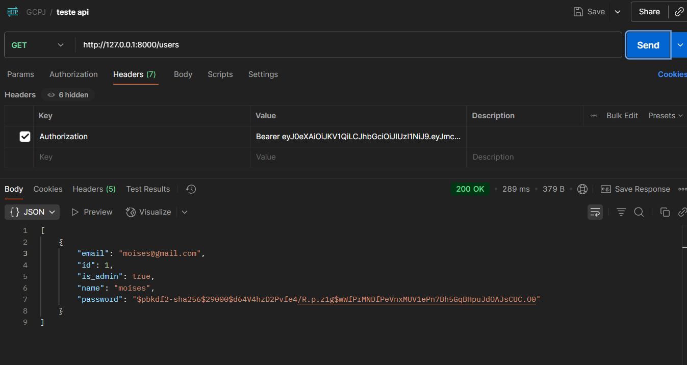

# API REST FULL

Inicialize o Venv
````
python -m venv .venv
````

Acessar o venv
````
.venv\Scripts\Activate.ps1
````

Instale as dependencias
````
pip install -r requirements.txt
````

Instale o banco de dados
````
docker run -d --name postgres_jpa -e POSTGRES_USER=root -e POSTGRES_PASSWORD=SenhaForte123 -e POSTGRES_DB=jpa -p 5432:5432 postgres:15
````

Configure a variavel de ambiente
````
$env:FLASK_APP = "api"
````

Inicialize o Migrate
````
flask db init
````

Comite o Migrate
````
flask db migrate -m "criação da tabela usuario"
````

Rode o Migrate
````
flask db upgrade
````


### Primeirs passos

Crie o usuario




Faça Login para obter o Token, capture o valor do token para acessar a rota que nescessita do token


Coloque o Token no Header, e antes do Token coloque "Bearer"



### Acesse a doumentação pleo Swagger

````
http://127.0.0.1:8000/apidocs/#/
````